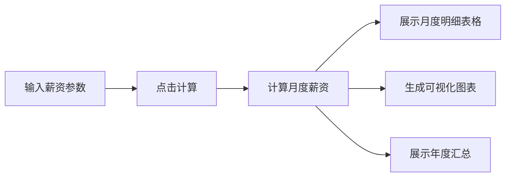

## 1. 产品概述

薪资计算器是一款帮助用户快速计算个人税后收入的工具。用户输入月薪资、年终奖月数和公积金缴纳比例，即可生成12个月的详细薪资数据、可视化图表和全年汇总，直观了解收入结构。

- 核心价值：让用户清晰了解每月薪资构成、五险一金扣除、个税缴纳及实际到手金额
- 目标用户：工薪阶层、HR、求职者等需要了解收入明细的人群

## 2. 核心功能

### 2.1 用户角色
| 角色 | 注册方式 | 核心权限 |
|------|----------|----------|
| 普通用户 | 无需注册 | 使用薪资计算功能，查看计算结果和图表 |

### 2.2 功能模块
1. **薪资输入区**：月基本薪资、年终奖月数、公积金缴纳比例输入表单
2. **月度薪资明细**：12个月的薪资数据表格展示
3. **可视化图表**：每月薪资构成占比饼图、全年收入趋势柱状图
4. **年度汇总**：全年总收入、五险一金总额、个税总额、到手总额等

### 2.3 页面详情
| 页面名称 | 模块名称 | 功能描述 |
|----------|----------|----------|
| 首页 | 输入表单 | 月薪资输入、年终奖月数输入、公积金比例输入、计算按钮 |
| 首页 | 月度明细表格 | 12个月薪资数据列表，包含总薪资、五险一金、公积金、个税、到手金额 |
| 首页 | 图表展示区 | 月度薪资构成饼图（可切换月份）、全年收入对比柱状图 |
| 首页 | 年度汇总卡片 | 年薪资总额、五险一金总额、公积金总额、个税总额、到手总额 |

## 3. 核心流程

用户在输入区填写薪资参数 → 点击计算按钮 → 系统计算12个月薪资明细 → 展示月度数据表格 → 展示可视化图表 → 展示年度汇总数据

## 4. 用户界面设计

### 4.1 设计风格
- **主色调**：深邃藏青 (#1e3a5f)，专业稳重，适合财务工具
- **辅助色**：翠绿 (#10b981) 表示到手收入，琥珀橙 (#f59e0b) 表示个税，蓝色 (#3b82f6) 表示五险一金
- **按钮风格**：圆角矩形，渐变背景，悬浮微上浮效果
- **字体**：使用现代无衬线字体，数字使用等宽字体增强可读性
- **布局风格**：卡片式布局，分区清晰，大量留白提升阅读体验
- **图标风格**：简约线性图标，统一风格

### 4.2 页面设计概览
| 页面名称 | 模块名称 | UI元素 |
|----------|----------|--------|
| 首页 | 输入表单 | 卡片容器、标签+输入框组合、滑块/数字输入、主按钮 |
| 首页 | 月度明细 | 表格组件、斑马纹行、金额右对齐、颜色区分 |
| 首页 | 图表区 | 饼图容器、月份切换标签、柱状图容器 |
| 首页 | 年度汇总 | 数据卡片网格、大数字展示、图标+金额组合 |

### 4.3 响应式
- 桌面端优先设计，自适应宽度
- 移动端：表格横向滚动，图表自适应，卡片单列布局
- 触摸优化：按钮最小48px，输入框充足间距

### 4.4 动效设计
- 页面加载：卡片渐入动画，错落延迟
- 数据更新：数字滚动动效
- 按钮悬浮：轻微上浮+阴影加深
- 图表加载：数据动画过渡
