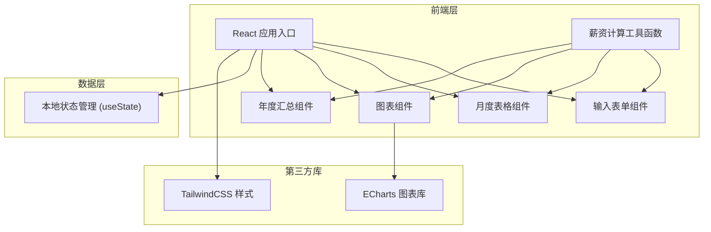

## 1. 架构设计



## 2. 技术说明

- **前端框架**：React@18 + TypeScript
- **构建工具**：Vite@5
- **样式方案**：TailwindCSS@3
- **图表库**：echarts + echarts-for-react
- **状态管理**：React useState (简单场景，无需Redux)
- **计算逻辑**：纯函数工具模块，独立于组件

## 3. 目录结构

```
src/
├── components/
│   ├── SalaryInput.tsx      # 薪资输入表单
│   ├── MonthlyTable.tsx     # 月度薪资表格
│   ├── SalaryChart.tsx      # 薪资图表
│   └── YearlySummary.tsx    # 年度汇总
├── utils/
│   └── salaryCalculator.ts  # 薪资计算核心逻辑
├── types/
│   └── salary.ts            # 类型定义
├── App.tsx                  # 主应用组件
├── main.tsx                 # 入口文件
└── index.css                # 全局样式
```

## 4. 数据模型

### 4.1 类型定义

```typescript
// 输入参数
interface SalaryInput {
  monthlySalary: number;      // 月基本薪资
  yearEndBonusMonths: number; // 年终奖月数
  housingFundRatio: number;   // 公积金缴纳比例 (0-1)
}

// 月度薪资明细
interface MonthlySalary {
  month: number;              // 月份 (1-12)
  totalSalary: number;        // 当月总薪资（含奖金等）
  socialInsurance: number;    // 五险一金（个人部分）
  housingFund: number;        // 公积金（个人部分）
  tax: number;                // 个人所得税
  netSalary: number;          // 到手金额
  taxableIncome: number;      // 应纳税所得额
}

// 年度汇总
interface YearlySummary {
  totalSalary: number;        // 全年总收入
  totalSocialInsurance: number; // 全年五险一金总额
  totalHousingFund: number;   // 全年公积金总额
  totalTax: number;           // 全年个税总额
  totalNetSalary: number;     // 全年到手总额
}
```

## 5. 薪资计算规则

### 5.1 五险一金（个人部分）
- 养老保险：8%
- 医疗保险：2%
- 失业保险：0.5%
- 公积金：用户自定义比例（5%-12%）

### 5.2 个人所得税（累计预扣法）
- 起征点：5000元/月
- 采用累计预扣法，按年计算，月度预扣
- 税率表（综合所得）：
  - 不超过36000元：3%
  - 超过36000元至144000元：10%，速算扣除数2520
  - 超过144000元至300000元：20%，速算扣除数16920
  - 超过300000元至420000元：25%，速算扣除数31920
  - 超过420000元至660000元：30%，速算扣除数52920
  - 超过660000元至960000元：35%，速算扣除数85920
  - 超过960000元：45%，速算扣除数181920

### 5.3 年终奖计算
- 年终奖金额 = 月薪资 × 年终奖月数
- 年终奖单独计税（可选择并入综合所得，默认单独计税）
- 年终奖税率：按月折算后查找税率
